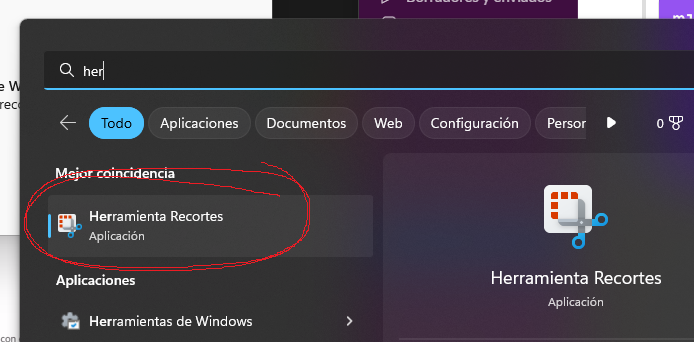

# Aprendiendo Markdown

## Toqueteando cositas
En este proyecto el objetivo es crear un ***análisis de datos*** virtual.
- Lista de tareas:
    - Limpar los datos
    - Visualizar los datos


## Insertar un fragmento de código
```python
print("Hola")
```
Osea usamos los 3 **`**

> Sirve para crear "citas"

Este [link](https://books.adalab.es/materiales-d.a.-promo-d/MPxNHee6q7eZ6OGz2Dgx/) lleva a los materiales de Adalab



**Para incluir imágenes:**
1. !
2. [nombre-imagen]
3. (link-imagen; ruta-imagen-ordenador; -link-git)

Para insertar tablas puede se puede utilizar la siguiente [página](https://www.tablesgenerator.com/markdown_tables).

| Impares | Pares  | 
|---------|--------|
| 1       | 2      |
| 3       | 4      |
| 5       | 6      |

> Y ya estaría :)

```python
print("Eres la puta ama")
```
Actualizar